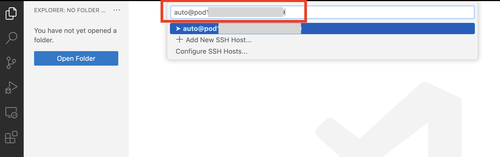

# DEVWKS-2042: How to become an IOS XE Terraform Expert
### This DevNet Workshop was created for Cisco Live AMEA 2024

## Introduction
Welcome to How to become an IOS XE Terraform Expert! In this workshop, you will learn:
* What Terraform is and how to use it
* How to work with the Terraform Cisco IOS XE provider
* How to manage Cisco IOS XE device configuration using Terraform


## Background
**Why’s it important?** 
Terraform is a tool for scalability to manage multiple devices at once. Terraform can be used to cloud resources as well as Cisco devices such as Catalyst Center, Meraki and network devices running Cisco IOS XE. 

Typically, we work with imperative approach, where we run through CLIs or code configuration line-by-line to make a change. However, Terraform uses a declarative approach, we focus on the end result that we want and Terraform will determin the step-by-step actions neede to reach that end goal.


**How do I get started?**
What does documentation mean / how can I use it?
Prerequisites: 
* On a local machine (such as a Linux Virtual Machine), install Terraform
* On the Cisco IOS XE device, enable RESTCONF, AAA and create a user.
Luckily for you, in this lab, those pre-req’s are already met :) 

Once Terraform is intalled, you will need to use or create terraform files. We'll be looking at some example .tf files in this lab. To use Terraform, let's understand these three commands:
1. `terraform init` - initialize Terraform to use the latest versions of the providers for your use case
1. `terraform plan` - generate an overview of everything that will be added and deleted when you run terraform apply in the next step. This is helpful in ensuring your file will function as expected
1. `terraform apply` - use Terraform to apply the changes in your Terraform file to you resources

Now that you've learned the basics of Terraform, let's get hands-on with some examples.


## Hands on
### Accessing the lab
1. Connect to your environment using Visual Studio Code remote SSH extension. Use the Steps below to follow the process in this demo:
 


> **Note**: You should have a numbered placecard at your workstation with your pod number. If you are accessing this lab after the workshop, you can run this lab using the DevNet Sandbox. See login information and credentials: 

**STEPS:**
<html>
<table>

<tr><th>Step</th><th width=50%>Description</th><th>Screenshot / code snippet</th></tr>

<tr><td>1.</td><td>

Open the Microsoft Visual Studio Code application from your desktop.

</td><td>

 
</td></tr>

<tr><td>2.</td><td>

To connect to your Linux Developer VM, click the green icon on the left bottom of Visual Studio Code application.

</td><td>


</td></tr>

<tr><td>3.</td><td>

Select `Connect to Host...`.

</td><td>


</td></tr>
<tr><td>4.</td><td>
    
Fill in the connection details to your pod's VM: `auto@pod<xx>-xelab.cisco.com` where `<xx>` should be replaced with the number of your pod. For example pod 5 would be `auto@pod05-xelab.cisco.com` and pod 11 would be `auto@pod11-xelab.cisco.com`.

> **Note**: If you are prompted to select the platform of the remote host, click `Linux`.

</td><td>



</td></tr>
<tr><td>5.</td><td>

If prompted to verify the Fingerprint, click `Continue`.

</td></tr>
<tr><td>6.</td><td>

Fill in the password that the instructor has provided you.


</td></tr>
<tr><td>7.</td><td>

After Visual Studio Code has copied necessary files for the remote session, the window will update to match the settings on the developer VM. You can verify that you are connected the correct pod in the lower-left corner of the Visual Studio Code window.

> **Note**: If the terminal view does not show up automatically, you can open it from the top menu of Visual Studio Code application: `Terminal` > `New terminal`
</td><td>


</td></tr>
</table>
</html>
Now, you should be sucessfully logged into your pod with access to the files within the pod! Note: You need to input your password twice to reach this step. If you don't see the files on the left side of your Visual Studios Window, please raise your hand and a proctor will help you access!


### Let's Dive In!
1. If you don't already have a terminal window open within Visual Studios Code, open one. You can do this by navigating to the toolbar at the top. Select "Terminal" > "New Terminal"

1. Clone this repository directly into your pod to be able to use the source code. Use the following command to perform a clone in the terminal of Visual Studios Code

```bash
git clone https://github.com/sdeweese/DEVWKS-2042.git
```

1. We'll be using Terraform throughout this session, so from the newly-cloned repository, navigate to the folder for this lab
```bash
cd DEVWKS-2042
```

1. All Terraform files in the same  directory will be applied when you run `terraform apply`. For this lab, we've broken them up into different sections. Let's start with the VLAN example

1. Within the Terminal window, navigate to the vlan directory
```bash
cd vlan
```

1. Open the `terraform-vlan.tf` file in Visual Studios Code. Note, you'll can to navigate to DEVWKS-2042 > vlan in the left-hand side to open the file


1. Notice that we are using the Terraform IOS XE provider. For our provider, we are providing the necessary credentials for logging into our device via RESTCONF to make configuration changes. In this case, we will create a VLAN and store the information about that VLAN in the Terraform state.

1. Split the terminal Window (or open a second window) to access the Catalyst 9300 switch


1. You can monitor the updates to your device by running `term mon` on your Catalyst Device


1. We can check the current VLANs on our device using `show VLAN


1. Now, back in the Linux Terminal window, run `terraform init` to intitialize Terraform and ensure we're using the version of the Cisco IOS XE provider specified near the top of the `terraform-vlan.tf` file. Can you determine which version we'll use?


1. Let's plan out what this Terraform file will do by running `terraform plan`


1. Now that we're confident in the changes Terraform will make, we can run `terraform apply`. We'll be prompted to confirm we'd like to continue. Type `yes`


1. Verify that the configuration was added properly by checking the show vlan brief config on the switch
`show vlan br`


1. We've sucessfully added a new VLAN to our device!

1. Now what happens if we decide we no longer want the configuration that Terraform has added? Luckily, Terraform is stateful, meaning it "remembers" the configuration it has added or removed previously. This means we don't need a separate Terraform file for removing or unconfiguring a Catalyst switch. Rather, we can use the `terraform destroy` command to remove the VLAN we just created. Similar to `terraform apply`, `terraform destroy` requires us to confirm we want to proceed with the action. Type `yes`


1. Now, we can confirm that the VLAN was properly removed using the same show command as above `show vlan br`. Here, we see that VLAN 100 has been removed


## Conclusion & Resources
Thank you for your time an effort in this lab! You're a Terraform expert!

In this lab, we've used
1. `terraform init` - initialize Terraform to use the latest versions of the providers for your use case
1. `terraform plan` - generate an overview of everything that will be added and deleted when you run terraform apply in the next step. This is helpful in ensuring your file will function as expected
1. `terraform apply` - use Terraform to apply the changes in your Terraform file to you resources


**Where do you go from here?**
For any feature that you can manage with RESTCONF, you can manage it using terraform. If you don't see specific documentation or a resource for the feature you're looking to manage, you can use the CLI RPC.
Retrieve run config formatted with JSON for RESTCONF
Generate the JSON of the current running config using  `show run | format restconf-json`

This will provide an output similar to this
```bash
cat9300x-pod17a#sh run | format restconf-json
{
 "data": {
  "Cisco-IOS-XE-native:native": {
    "version": "17.15",
    "boot": {
      "Cisco-IOS-XE-switch:enable-break-per-switch": {
        "enable-break": [
          {
            "switch": 1
          }
        ]
      }
    },
    "memory": {
      "free": {
        "low-watermark": {
          "processor": 105463
        }
      }
    },
    "service": {
      "internal": [null],
      "timestamps": {
        "debug-config": {
          "datetime": {
            "msec": [null],
            "localtime": [null],
            "show-timezone": [null],
            "year": [null]
          }
        },
        "log-config": {
          "datetime": {
            "msec": [null],
            "localtime": [null],
            "show-timezone": [null],
            "year": [null]
          }
        }
      }
    },
    "hostname": "cat9300x-pod17a",
<snip>
```

We can use this restconf-json formmatting to build out additional information to add to the jsoncode section of the Terraform RESTCONF payload.

Here are some resources to continue your education and learning to sharpen your Terraform skills further
### Resources
* [Terraform registry](https://registry.terraform.io/providers/CiscoDevNet/iosxe/latest) for Terraform IOS XE provider
* [Terraform GitHub](https://github.com/CiscoDevNet/terraform-provider-iosxe) source code and examples